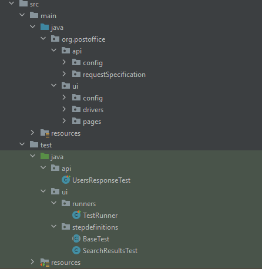

# postofice-techtest
Technical test that contains the code repo for UI and API

## Overview
- This project is a Java Maven-based automation framework designed for both UI and API testing. 
- The UI tests utilize Selenium, Cucumber, and JUnit 5, while the API tests leverage RestAssured and JUnit 5. 

## Table of Contents
1. [Prerequisites]()
2. [Project Structure]()
3. [Dependencies]()
4. [Compile & Running Tests]()
5. [Configuration]()
6. [CI]()

## Prerequisites
- Java JDk 17 or higher
- Maven 3.9.4 or higher
- An IDE (e.g., IntelliJ IDEA, Eclipse) with Maven support
- Chrome Browser (latest)

## Project Structure

- UI tests follow a Page Object model and is defined in [src/main/java/org/postoffice/ui/pages](src/main/java/org/postoffice/ui/pages)
- UI Tests written in BDD style and the feature file is available in [src/test/resources/features/Search.feature](src/test/resources/features/Search.feature)
- API tests have a request specification defined in [src/main/java/org/postoffice/api/requestSpecification](src/main/java/org/postoffice/api/requestSpecification)
- Test Logs are saved in [logs](logs) folder

## Dependencies
The project dependencies are managed through Maven.

Key dependencies include:

- Selenium for UI testing (V 4.23.0)
- Cucumber for BDD-style tests (V 7.18.1)
- JUnit 5 for Assertion library (V 5.11)
- RestAssured for API testing (V 5.5)
- Log4J for logging

## Compile & Running Tests

### Compile
`mvn clean compile`

### Run UI tests - Browser mode - Run locally on a machine
1. Set `headless = false` (default true) in [src/main/resources/ui/config.properties](src/test/resources/features/Search.feature)
2. `mvn test -Dtest=ui.runners.TestRunner`

#### Run UI tests - Headless mode - Run on CI and locally on a machine 
1. Set `headless = true` in [src/main/resources/ui/config.properties](src/test/resources/features/Search.feature)
2. `mvn test -Dtest=ui.runners.TestRunner`
    
### Run API tests
`mvn test -Dtest=api.JsonPlaceholderApiTest`

### Run All tests
`mvn test`

## Configurations
- Available configurations for UI are in this path -  [src/main/resources/ui/config.properties](src/test/resources/features/Search.feature)
- Available configurations for API are in this path -  [src/main/resources/api/config.properties](src/test/resources/features/Search.feature)

## CI
- The project uses GitHub actions and is configured in - [.github/workflows/maven.yaml](.github/workflows/maven.yaml)
- Both UI and API tests are run inside the containers
